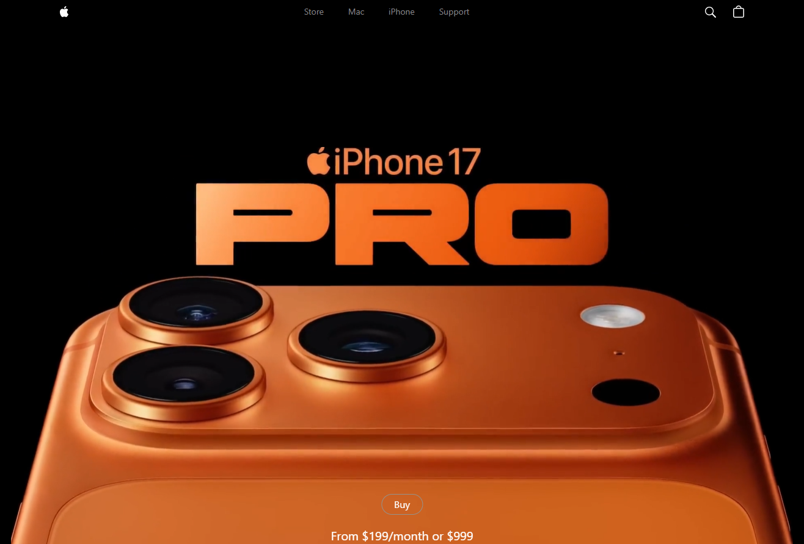
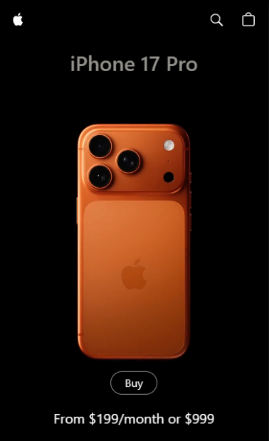
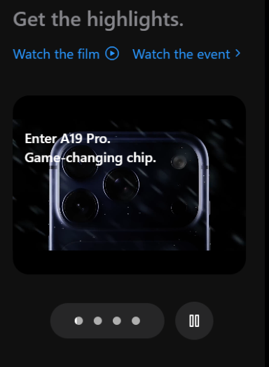

# iPhone 17 Pro Landing

Aplicación web interactiva para mostrar las características, modelos y novedades del iPhone 17 Pro. Desarrollada con React, Vite, GSAP, Tailwind CSS y Three.js para visualización 3D.

## 🖼️ Vista previa

**Hero principal:**

### Responsive Design / mobile view

**Vista en dispositivos móviles:**

**Visualización de modelos 3D:**

### Carrusel de modelos y videos

**Carrusel interactivo de modelos y videos:**

## 🚀 Demo

Proyecto desplegado en vercel. Incluye animaciones, interacción touch y visualización e interaccion 3D.

## 🛠️ Tecnologías

- React (ES6+)
- Vite
- Tailwind CSS
- Three.js / @react-three/drei (Modelo 3D)
- GSAP (animaciones)
- HTML5

## ✨ Funcionalidades

- Visualización 3D de modelos de iPhone
- Carrusel de videos destacados
- Animaciones GSAP al hacer scroll
- Cambios de color y estilo en tiempo real
- Responsive design para móviles y desktop
- Barra de progreso sincronizada con video
- Sección de features y especificaciones

## 📂 Estructura del proyecto

- `index.html` → Landing principal
- `src/App.jsx` → Componente raíz
- `src/components/` → Componentes principales (Hero, Features, HowItWorks, ModelView, VideoCarousel, etc.)
- `src/constants/` → Datos de modelos, textos y videos
- `public/assets/` → Imágenes, videos y modelos 3D

## 🧠 Aprendizajes

- Integración de Three.js en React para visualización 3D
- Animaciones avanzadas con GSAP y scrollTrigger
- Manejo de estados y props en React
- Diseño responsive con Tailwind CSS
- Sincronización de UI con eventos de video

## 📌 Próximas mejoras

- Animaciones 3D más avanzadas y realistas
- Mejorar la experiencia touch y gestos en móviles
- Agregar selector de fondos y ambientes para el modelo 3D
- Integrar comparador interactivo entre modelos
- Optimizar carga de assets y modelos para mayor velocidad
- Mejorar accesibilidad (navegación por teclado, etiquetas ARIA)
- Agregar modo oscuro/oscuro automático
- Internacionalización (multi-idioma)

---

## ℹ️ Contexto técnico

Este proyecto fue desarrollado para explorar la integración de animaciones, visualización 3D y diseño moderno en React, usando Vite como entorno de desarrollo rápido. El objetivo es crear una experiencia de producto premium, similar a la web oficial de Apple.

## ▶️ Cómo ejecutar el proyecto

1. Clona el repositorio.
2. Instala dependencias con `npm install`.
3. Ejecuta el servidor local con `npm run dev`.
4. Abre la URL local en tu navegador.

## 📝 Notas

- Vercel Link: https://iphone17pro-max.vercel.app/

- Los modelos 3D están en formato GLB y se cargan desde la carpeta `public/models`.
- GSAP y ScrollTrigger requieren que los elementos tengan IDs únicos para triggers precisos.
- El proyecto es totalmente responsive y optimizado para touch.
